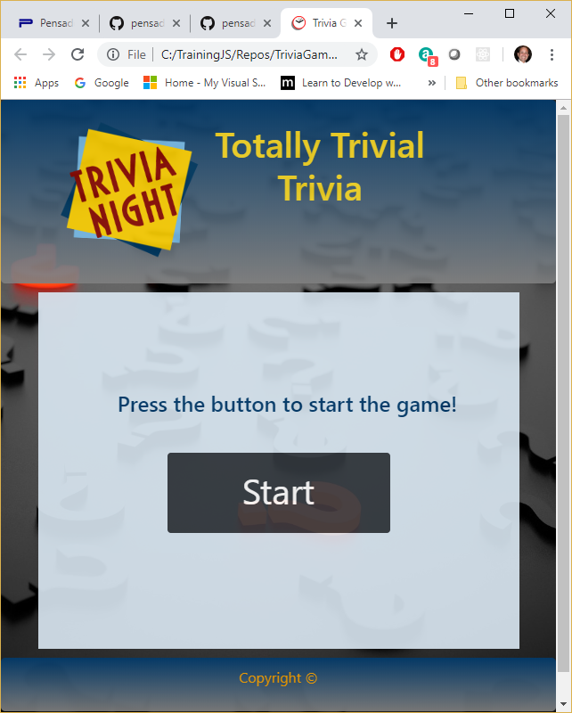
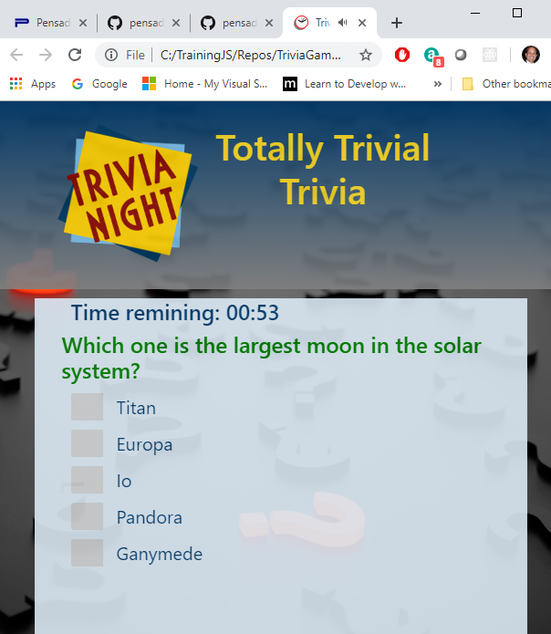
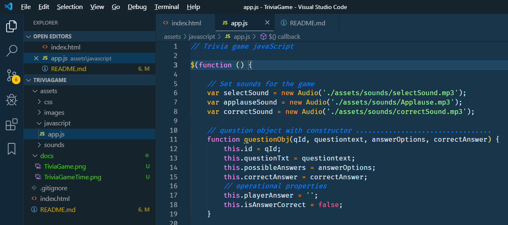

# Trivia game

Check your knowledge about are solar system.

_By Armando Pensado_

## Description

This game is a trivia game that test the user’s knowledge of our solar system. Every time the application is started will organize at random ten questions, and present each one a time to the user. The player has one minute to answer as much questions as possible.  If an answer is not correct the application will provide feedback to allow the player to know a bit more about the solar system.

One minute to answe as many questions as possible

## Who can benefit from this application

This project is a good example for beginner web developers that are learning HTML, CSS, and JQuery.

## How developers can get started

The developer is welcome to clone or download the project to the personal device. The project can be executed in any browser, and can be visualized using MS Visual code.

There is not specials initialization instructions, as it is plain HTML, CSS, and JQuery.

The developer will find a **app.js** file that contains the core of the functionality. In there, the **'game'** object represents the game, and it uses the **questionGenerator** object to set the questions for the game.

The bottom section has the events for controlling the user input and process teh selections.

After cloning the application and using Microsoft Visual Studio, the project folder should resemble as depicted below.

## Who maintains and contributes to the project

This is a project for my personal learning process.

## Project references

* JavaScript : MDN https://developer.mozilla.org/en-US/docs/Web/JavaScript
* w3schools JavaScript tutotials : https://www.w3schools.com/js/
* w3schools HTML tutorials : https://www.w3schools.com/html/default.asp
* w3schools CSS tutorials : https://www.w3schools.com/css/default.asp

